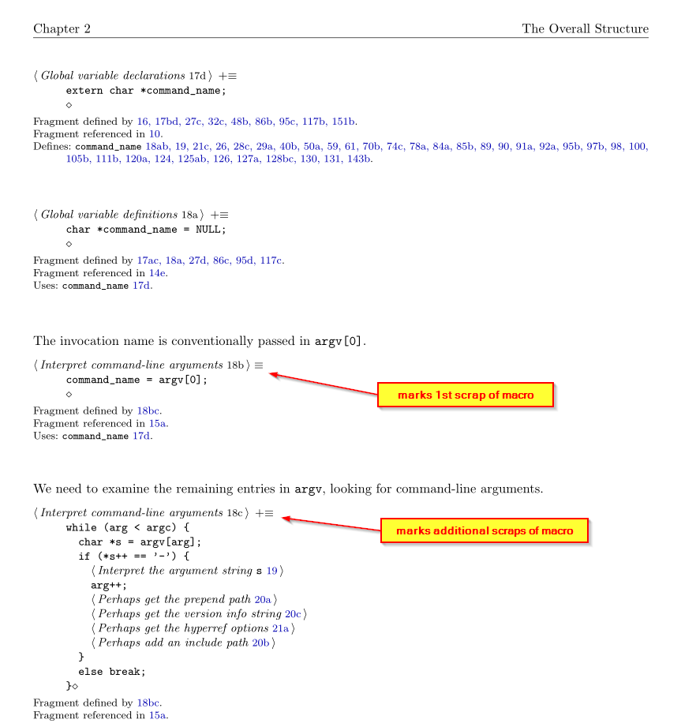

# Changes made by Roman Bartke

## Different marker for the first and all subsequent scraps of a macro.

Macro definitions with multiple scraps are followed by "\,\rangle\equiv" on the first one and by "\,\rangle\,\mathrel+\equiv" on all subsequent ones.

